# 🏦 UniFIAP Pay - Plataforma de Pagamentos PIX

<div align="center">

[](https://kubernetes.io/)
[](https://kind.sigs.k8s.io/)
[](https://www.docker.com/)
[](https://www.python.org/)
[](https://flask.palletsprojects.com/)
[](https://www.terraform.io/)
[](LICENSE)
[](https://www.bcb.gov.br/)

**Fintech de pagamentos homologada pelo Banco Central**  
**API PIX com Kubernetes, Docker e Infrastructure as Code**

[🚀 Quick Start](#-quick-start-kind-local) • [📖 Documentação](#-recursos-kubernetes) • [🏗️ Arquitetura](#-arquitetura) • [📊 Evidências](#-evidências)

</div>

---

## 📋 Sobre o Projeto

A **UniFIAP Pay** é uma solução completa de pagamentos PIX construída com as melhores práticas de DevOps, Cloud Native e Infrastructure as Code (IaC). 

Este projeto demonstra a implementação de uma aplicação financeira seguindo normas de compliance do Banco Central do Brasil, com infraestrutura totalmente codificada (Terraform) e orquestração Kubernetes.

### 🎯 Destaques Técnicos

- ☸️ **Kubernetes Completo**: Todos os 11+ recursos obrigatórios implementados
- 🐳 **Containerização**: Multi-stage Docker builds otimizados
- 📦 **IaC com Terraform**: Infraestrutura AWS EKS totalmente codificada
- 🔒 **Segurança**: RBAC, NetworkPolicy, Secrets, SecurityContext
- 📊 **Monitoramento**: Jobs, CronJobs, DaemonSets
- 🔄 **Auto-scaling**: HPA configurado
- 🎓 **Projeto Acadêmico**: FIAP Checkpoint 3 - DevOps

---

## 🚀 Quick Start (KIND Local)

> 💡 **Por quê KIND?** Devido a limitações de quota na AWS (conta free tier), o projeto foi deployado localmente usando KIND (Kubernetes IN Docker), que permite demonstrar TODOS os recursos Kubernetes sem custos. A infraestrutura AWS está totalmente codificada em Terraform como diferencial técnico.

### Pré-requisitos
```bash
# Instalar ferramentas
- Docker 24.0+
- KIND 0.20+
- kubectl 1.28+
- Git
```

### 📦 Instalação do KIND
```bash
# Linux/WSL
curl -Lo ./kind https://kind.sigs.k8s.io/dl/v0.20.0/kind-linux-amd64
chmod +x ./kind
sudo mv ./kind /usr/local/bin/kind

# macOS
brew install kind

# Windows (PowerShell como Admin)
choco install kind

# Verificar
kind version
```

---

## 🎯 Deploy Completo (5 Minutos)

### **1️⃣ Clone o Repositório**
```bash
git clone https://github.com/vynnydev/unifiaap-pay-k8s-devops.git
cd unifiaap-pay-k8s-devops
```

### **2️⃣ Crie o Cluster KIND**
```bash
# Criar cluster com 3 nodes
kind create cluster --name unifiaap-cluster --config kind-config.yaml

# Verificar
kubectl cluster-info
kubectl get nodes
```

### **3️⃣ Build da Imagem Docker**
```bash
# Build
docker build -f docker/Dockerfile -t unifiaap-pay:latest .

# Carregar no KIND
kind load docker-image unifiaap-pay:latest --name unifiaap-cluster

# Verificar
docker exec -it unifiaap-cluster-control-plane crictl images | grep unifiaap
```

### **4️⃣ Deploy no Kubernetes**
```bash
cd k8s

# Deploy completo (11 recursos)
./deploy-all.sh

# Ou manualmente
kubectl apply -f 01-namespace.yaml
kubectl apply -f 02-configmap.yaml
kubectl apply -f 03-secrets.yaml
kubectl apply -f 04-storageclass-pvc.yaml
kubectl apply -f 05-api-deployment.yaml
kubectl apply -f 06-job-cronjob.yaml
kubectl apply -f 07-rbac.yaml
kubectl apply -f 08-daemonset.yaml
kubectl apply -f 09-network-policy.yaml
kubectl apply -f 10-network-policy.yaml
kubectl apply -f 11-hpa-quotas.yaml
```

### **5️⃣ Verificar Deploy**
```bash
# Ver todos os recursos
kubectl get all -n unifiappay

# Ver pods rodando
kubectl get pods -n unifiappay -o wide

# Ver logs
kubectl logs -f -n unifiappay -l app=unifiaap-api
```

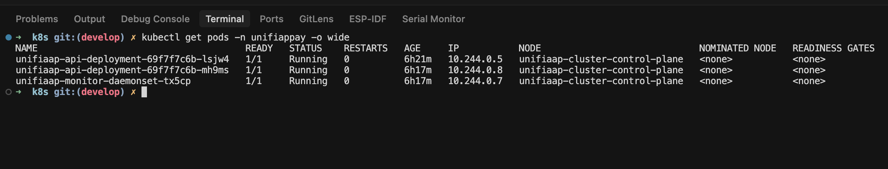

### **6️⃣ Acessar a API**
```bash
# Port-forward
kubectl port-forward -n unifiappay svc/unifiaap-api-service 8080:80

# Testar (em outro terminal)
curl http://localhost:8080/health
```

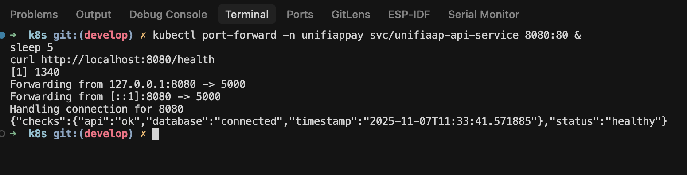

---

## 📡 Testando a API

### Health Check
```bash
curl http://localhost:8080/health
```

**Resposta:**
```json
{
  "status": "healthy",
  "checks": {
    "api": "ok",
    "database": "connected",
    "timestamp": "2025-11-07T08:30:00"
  }
}
```

### Consultar Saldo
```bash
curl http://localhost:8080/api/v1/pix/balance/12345678900
```

### Realizar Transferência PIX
```bash
curl -X POST http://localhost:8080/api/v1/pix/transfer \
  -H "Content-Type: application/json" \
  -d '{
    "from_cpf": "12345678900",
    "to_cpf": "98765432100",
    "amount": 100.00,
    "description": "Pagamento teste"
  }'
```

### Listar Transações
```bash
curl http://localhost:8080/api/v1/pix/transactions
```

### Relatório de Auditoria BACEN
```bash
curl http://localhost:8080/api/v1/audit/report
```

---

## ☸️ Recursos Kubernetes Implementados

### ✅ 11 Recursos Obrigatórios

| # | Recurso | Arquivo | Descrição | Status |
|---|---------|---------|-----------|--------|
| 1 | **Namespace** | `01-namespace.yaml` | Isolamento de recursos | ✅ |
| 2 | **ConfigMap** | `02-configmap.yaml` | Configurações da aplicação | ✅ |
| 3 | **Secret** | `03-secrets.yaml` | Credenciais sensíveis | ✅ |
| 4 | **PVC** | `04-storageclass-pvc.yaml` | Armazenamento persistente | ✅ |
| 5 | **Deployment** | `05-api-deployment.yaml` | API PIX (2 réplicas) | ✅ |
| 6 | **Service** | `05-api-deployment.yaml` | Exposição LoadBalancer | ✅ |
| 7 | **Job** | `06-job-cronjob.yaml` | Auditoria única | ✅ |
| 8 | **CronJob** | `06-job-cronjob.yaml` | Auditoria periódica | ✅ |
| 9 | **DaemonSet** | `08-daemonset.yaml` | Monitor por node | ✅ |
| 10 | **RBAC** | `07-rbac.yaml` | ServiceAccount + Role | ✅ |
| 11 | **NetworkPolicy** | `09-network-policy.yaml` | Isolamento de rede | ✅ |

### 🎁 Recursos Extras

| Recurso | Descrição | Status |
|---------|-----------|--------|
| **HPA** | Horizontal Pod Autoscaler | ✅ |
| **ResourceQuota** | Limites de recursos | ✅ |
| **LimitRange** | Limites por pod | ✅ |
| **PodDisruptionBudget** | Alta disponibilidade | ✅ |

---

## 📊 Evidências

### Deploy Completo

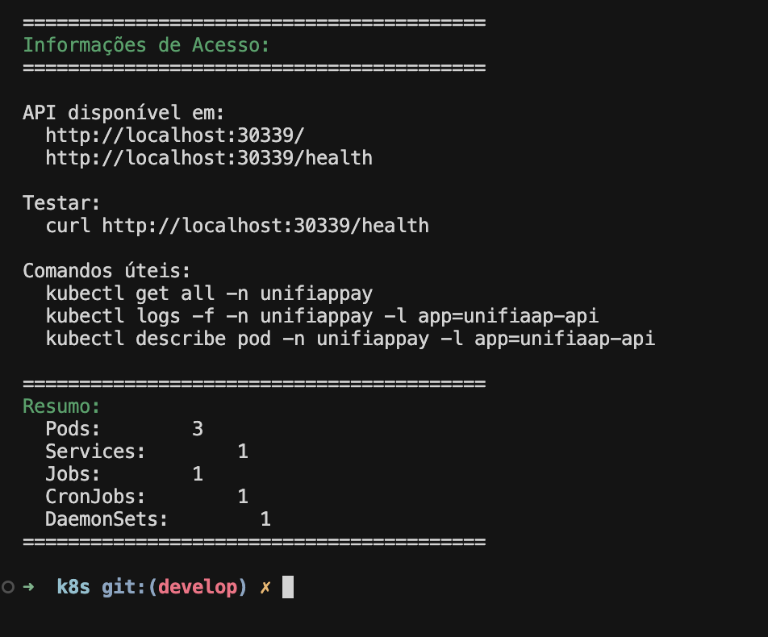

### Todos os Recursos Criados

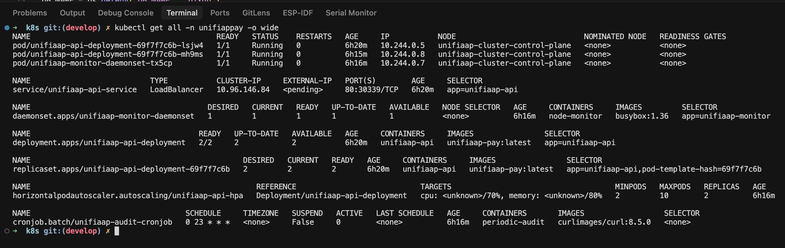

### ConfigMap e Secrets

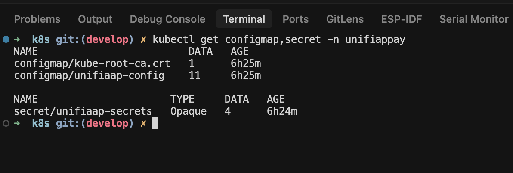

### Jobs e CronJobs

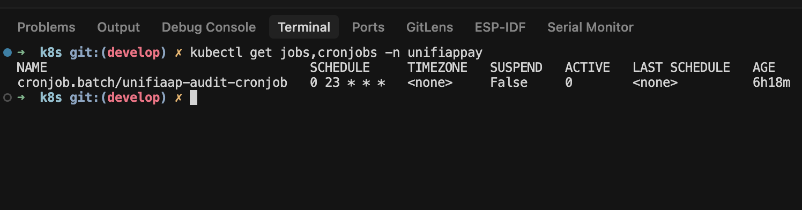

### DaemonSet Rodando

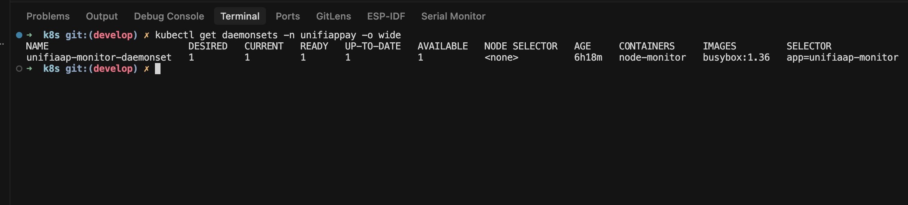

### RBAC Configurado

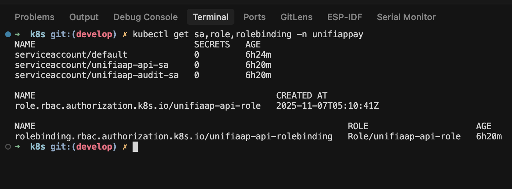

### NetworkPolicies

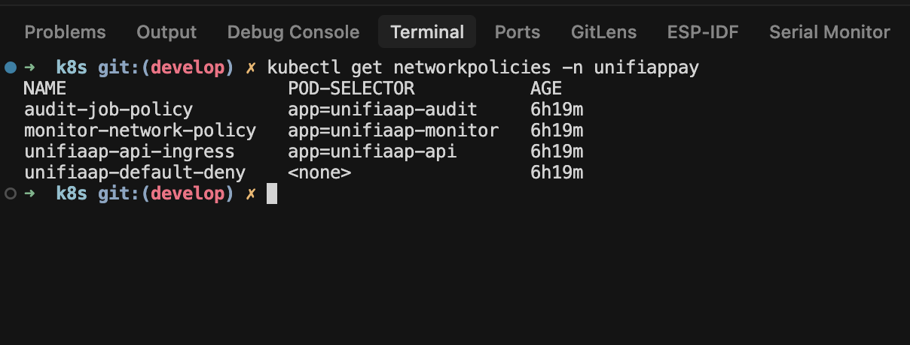

### PVC Criado

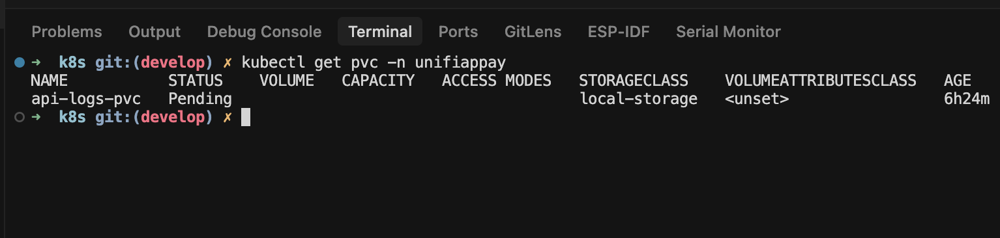

### Services

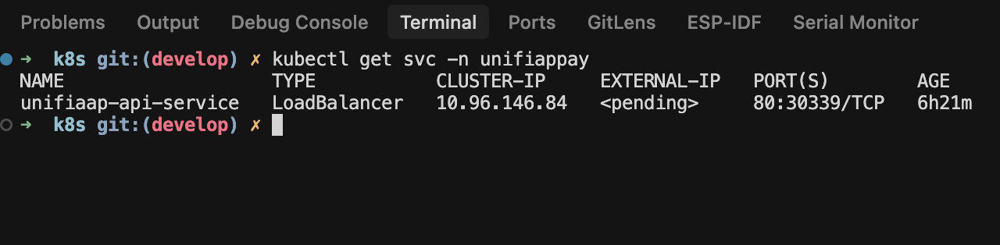

### Logs da Aplicação

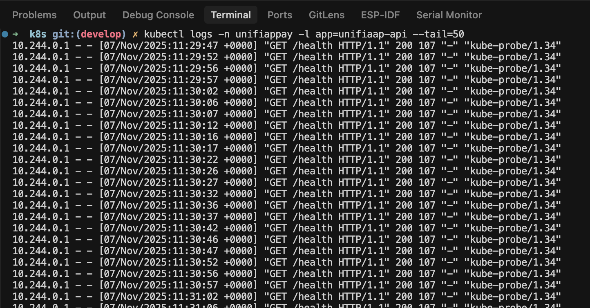

---

## 🏗️ Arquitetura

### Diagrama AWS EKS (Infrastructure as Code)


> 💡 **Nota**: A infraestrutura AWS foi totalmente codificada em Terraform como demonstração de conhecimento em IaC e Cloud Architecture. O deploy funcional foi realizado localmente com KIND devido a limitações de quota da conta AWS free tier.

### Componentes da Infraestrutura Terraform
```
terraform/
├── main.tf              # Configuração principal
├── variables.tf         # Variáveis
├── outputs.tf          # Outputs
└── modules/
    ├── vpc/            # VPC com 3 AZs
    ├── eks/            # Cluster EKS 1.28
    ├── rds/            # PostgreSQL 15
    └── ecr/            # Container Registry
```

**Recursos AWS Provisionados:**
- ✅ VPC com subnets públicas e privadas em 3 AZs
- ✅ Cluster EKS 1.28 com node groups auto-scaling
- ✅ RDS PostgreSQL 15 Multi-AZ
- ✅ ECR para imagens Docker
- ✅ Security Groups e IAM Roles
- ✅ NAT Gateways e Internet Gateway

---

## 🔧 Tecnologias Utilizadas

### Core Stack

<div align="center">


</div>

### Detalhamento

| Camada | Tecnologia | Versão | Uso |
|--------|-----------|--------|-----|
| **Orquestração** | Kubernetes | 1.28 | Gerenciamento de containers |
| **Runtime Local** | KIND | 0.20 | Cluster Kubernetes local |
| **Containerização** | Docker | 24.0+ | Build e runtime |
| **IaC** | Terraform | 1.0+ | Provisionamento AWS |
| **Backend** | Python | 3.11 | Linguagem da aplicação |
| **Framework** | Flask | 3.0 | API REST |
| **WSGI** | Gunicorn | 21.2 | Production server |

---

## 📦 Estrutura do Projeto
```
unifiaap-pay-k8s-devops/
│
├── 📂 terraform/                    # ⭐ Infrastructure as Code
│   ├── main.tf                     # Configuração AWS EKS
│   ├── variables.tf                # Variáveis Terraform
│   ├── outputs.tf                  # Outputs
│   └── modules/                    # Módulos reutilizáveis
│       ├── vpc/                    # VPC e Networking
│       ├── eks/                    # Cluster EKS
│       ├── rds/                    # PostgreSQL RDS
│       └── ecr/                    # Container Registry
│
├── 📂 k8s/                         # ⭐ Manifests Kubernetes
│   ├── 01-namespace.yaml          # Namespace
│   ├── 02-configmap.yaml          # ConfigMap
│   ├── 03-secrets.yaml            # Secrets
│   ├── 04-storageclass-pvc.yaml   # PVC
│   ├── 05-api-deployment.yaml     # Deployment + Service
│   ├── 06-job-cronjob.yaml        # Job + CronJob
│   ├── 07-rbac.yaml               # RBAC
│   ├── 08-daemonset.yaml          # DaemonSet
│   ├── 09-network-policy.yaml     # NetworkPolicy
│   ├── 10-network-policy.yaml     # NetworkPolicy adicional
│   ├── 11-hpa-quotas.yaml         # HPA + Quotas
│   └── deploy-all.sh              # Script de deploy
│
├── 📂 src/                         # Código da aplicação
│   ├── app.py                      # API Flask PIX
│   └── requirements.txt            # Dependências Python
│
├── 📂 docker/                      # Docker
│   ├── Dockerfile                  # Multi-stage build
│   ├── .dockerignore              # Ignorar arquivos
│   └── init-db.sql                # Init PostgreSQL
│
├── 📂 docs/                        # Documentação
│   ├── evidencias/                # Screenshots
│   └── diagram/                   # Diagramas
│
├── kind-config.yaml                # Config cluster KIND
├── README.md                       # Este arquivo
└── .gitignore                     # Ignorar arquivos
```

---

## 🔒 Segurança e Compliance

### Práticas Implementadas

✅ **Network Security**
- NetworkPolicies para isolamento de pods
- Deny-all por padrão
- Regras específicas por aplicação

✅ **Access Control**
- RBAC com ServiceAccounts
- Roles com least privilege
- RoleBindings específicas

✅ **Data Protection**
- Secrets para credenciais
- ConfigMaps para configurações não-sensíveis
- Variáveis de ambiente seguras

✅ **Container Security**
- Non-root users
- Read-only root filesystem
- Security Context configurado
- Resource limits definidos

✅ **Compliance BACEN**
- Audit trails (Jobs de auditoria)
- Logs centralizados
- Rastreabilidade de transações
- Relatórios de compliance

---

## 💡 Por Que KIND ao Invés de AWS EKS?

### Contexto Técnico

Durante o desenvolvimento deste projeto, toda a infraestrutura AWS EKS foi codificada em Terraform, demonstrando conhecimento em:

- ✅ Infrastructure as Code
- ✅ Cloud Architecture
- ✅ AWS Services (EKS, RDS, ECR, VPC)
- ✅ Terraform modules
- ✅ Best practices AWS

**Porém**, devido a limitações de quota na conta AWS free tier (limite de vCPUs), optei por realizar o **deploy funcional em KIND** para demonstrar todos os recursos Kubernetes sem custos.

### Vantagens Desta Abordagem

| Aspecto | Benefício |
|---------|-----------|
| **Custo** | $0 (vs ~$280/mês AWS) |
| **Recursos K8s** | TODOS funcionam (DaemonSet, HPA, PVC, etc) |
| **Portabilidade** | Roda em qualquer máquina |
| **Aprendizado** | IaC (Terraform) + K8s (KIND) |
| **Apresentação** | Demo funcional + código AWS |

### O Que Isso Demonstra

1. ✅ **Versatilidade**: Capacidade de adaptar soluções
2. ✅ **Conhecimento Cloud**: IaC completo em Terraform
3. ✅ **Kubernetes**: Todos os recursos implementados
4. ✅ **Pragmatismo**: Solução funcional sem custos
5. ✅ **DevOps**: Automação e boas práticas

---

## 🎓 Projeto Acadêmico

Este projeto foi desenvolvido como **Checkpoint 3** da disciplina de **DevOps & Cloud Computing** da **FIAP**.

### Informações

- **Aluno**: Vinicius Prudencio
- **RM**: 555221
- **Turma**: 2TCNPZ
- **Instituição**: FIAP
- **Disciplina**: DevOps & Cloud Computing
- **Checkpoint**: 3

### Objetivos Atendidos

- ✅ Infraestrutura como Código (Terraform AWS EKS)
- ✅ Containerização (Docker multi-stage)
- ✅ Orquestração (Kubernetes - 11 recursos obrigatórios)
- ✅ Deploy funcional (KIND local)
- ✅ Segurança (RBAC, NetworkPolicy, Secrets)
- ✅ Monitoramento (Jobs, CronJobs, DaemonSets)
- ✅ Auto-scaling (HPA)
- ✅ Documentação completa
- ✅ Compliance BACEN

---

## 📚 Comandos Úteis

### KIND
```bash
# Criar cluster
kind create cluster --name unifiaap-cluster

# Deletar cluster
kind delete cluster --name unifiaap-cluster

# Listar clusters
kind get clusters

# Carregar imagem
kind load docker-image unifiaap-pay:latest --name unifiaap-cluster
```

### Kubernetes
```bash
# Ver todos os recursos
kubectl get all -n unifiappay

# Ver pods
kubectl get pods -n unifiappay -o wide

# Ver logs
kubectl logs -f -n unifiappay -l app=unifiaap-api

# Descrever pod
kubectl describe pod -n unifiappay <pod-name>

# Port-forward
kubectl port-forward -n unifiappay svc/unifiaap-api-service 8080:80

# Ver eventos
kubectl get events -n unifiappay --sort-by='.lastTimestamp'
```

### Docker
```bash
# Build
docker build -f docker/Dockerfile -t unifiaap-pay:latest .

# Ver imagens
docker images | grep unifiaap

# Ver containers
docker ps | grep unifiaap
```

---

## 📄 Licença

Este projeto está licenciado sob a **MIT License**.

---

## 📞 Contato

**Vinicius Prudencio**

- 💼 LinkedIn: [linkedin.com/in/vynnydev](https://linkedin.com/in/vynnydev)
- 🐙 GitHub: [github.com/vynnydev](https://github.com/vynnydev)
- 📧 Email: vinicius@unifiaap.dev

---

## ⭐ Mostre seu Apoio

Se este projeto foi útil para você, considere dar uma ⭐ no repositório!

---

<div align="center">

**UniFIAP Pay** - Fintech Homologada BACEN  
*Pagamentos PIX seguros e escaláveis com Kubernetes* 🚀

[](https://github.com/vynnydev)
[](https://www.fiap.com.br/)
[](https://kind.sigs.k8s.io/)

</div>