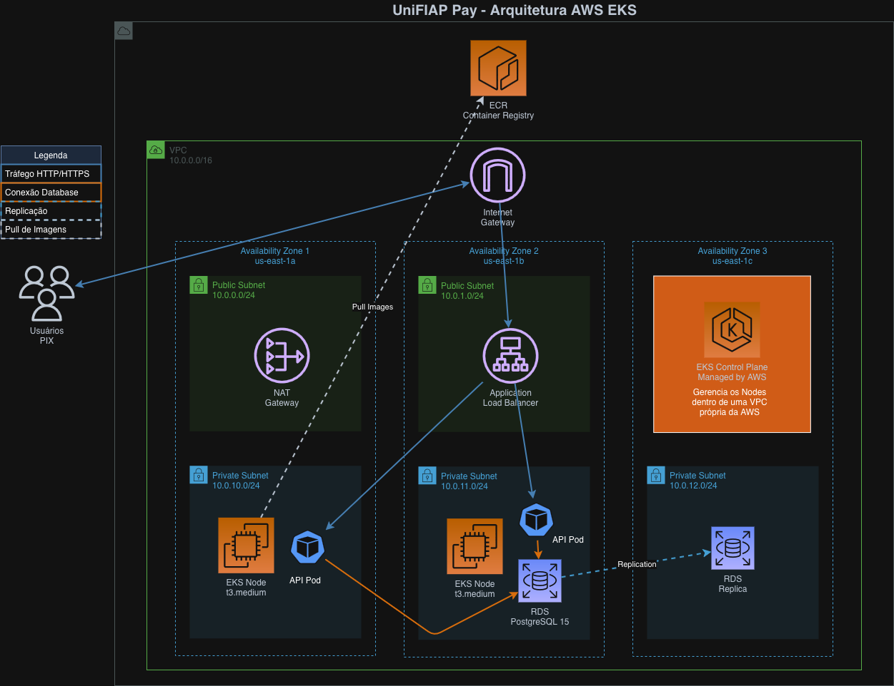

# 🏦 UniFIAP Pay - Plataforma de Pagamentos PIX

<div align="center">


[](https://aws.amazon.com/eks/)
[](https://www.terraform.io/)
[](https://kubernetes.io/)
[](https://www.docker.com/)
[](https://www.python.org/)
[](https://www.postgresql.org/)
[](https://flask.palletsprojects.com/)
[](LICENSE)
[](https://www.bcb.gov.br/)

**Fintech de pagamentos homologada pelo Banco Central, especializada em transações via PIX**

[📖 Documentação](#-documentação) • [🚀 Deploy](#-quick-start) • [🏗️ Arquitetura](#-arquitetura) • [📊 Evidências](#-evidências)

</div>

---

## 📋 Sobre o Projeto

A **UniFIAP Pay** é uma solução completa de pagamentos PIX construída com as melhores práticas de DevOps, Cloud Native e Infrastructure as Code (IaC). Este projeto demonstra a implementação de uma aplicação financeira em produção, seguindo normas de compliance do Banco Central do Brasil.

### 🎯 Objetivos

- ✅ Infraestrutura como Código (Terraform)
- ✅ Orquestração com Kubernetes (EKS)
- ✅ Containerização com Docker
- ✅ CI/CD automatizado
- ✅ Segurança e compliance BACEN
- ✅ Alta disponibilidade e escalabilidade
- ✅ Monitoramento e observabilidade

### ⭐ Destaques

- 🔒 **Segurança**: RBAC, NetworkPolicy, SecurityContext, Secrets Management
- 📈 **Escalabilidade**: HPA, Auto Scaling Groups, Load Balancing
- 🔍 **Observabilidade**: Logging, Monitoring, Audit Trails
- 🌐 **Cloud Native**: AWS EKS, RDS, ECR, ALB
- 📦 **IaC**: Terraform modular e reutilizável
- 🎓 **Projeto Acadêmico**: FIAP - Checkpoint 3 DevOps

---

## 🏗️ Arquitetura

### Diagrama de Infraestrutura



<details>
<summary>📝 Ver descrição detalhada da arquitetura</summary>

#### Componentes Principais:

**🌐 Rede (VPC)**
- VPC customizada (10.0.0.0/16)
- 3 Subnets públicas (para ALB/NAT)
- 3 Subnets privadas (para EKS/RDS)
- Internet Gateway e NAT Gateways
- Route Tables configuradas

**☸️ Kubernetes (EKS)**
- Cluster EKS 1.28
- Node Groups com Auto Scaling (2-10 nodes)
- Instâncias t3.medium
- EBS CSI Driver para volumes persistentes
- ALB Ingress Controller

**🗄️ Banco de Dados (RDS)**
- PostgreSQL 15.4
- Multi-AZ para alta disponibilidade
- Backup automático (7 dias)
- Encryption at rest
- db.t3.micro (dev) / db.t3.medium (prod)

**📦 Container Registry (ECR)**
- Repositórios privados
- Image scanning automático
- Lifecycle policies (manter últimas 10 imagens)
- Encryption AES256

**🔐 Segurança**
- Security Groups restritivos
- IAM Roles com least privilege
- Secrets Manager para credenciais
- NetworkPolicies no Kubernetes
- RBAC configurado

</details>

---

## 🚀 Quick Start

### Pré-requisitos
```bash
# Ferramentas necessárias
- AWS CLI 2.0+
- Terraform 1.0+
- kubectl 1.28+
- Docker 24.0+
- Git
```

### 1️⃣ Clone o Repositório
```bash
git clone https://github.com/vynnydev/unifiaap-pay-k8s-devops.git
cd unifiaap-pay-k8s-devops
```

### 2️⃣ Configure AWS Credentials
```bash
# Configure suas credenciais
aws configure

# Ou exporte as variáveis
export AWS_ACCESS_KEY_ID="sua-access-key"
export AWS_SECRET_ACCESS_KEY="sua-secret-key"
export AWS_DEFAULT_REGION="us-east-1"
```

### 3️⃣ Crie a Infraestrutura
```bash
cd terraform

# Inicialize o Terraform
terraform init

# Revise o plano
terraform plan

# Aplique as mudanças
terraform apply
```

**⏱️ Tempo estimado:** 15-20 minutos

<details>
<summary>📸 Ver exemplo de output do Terraform</summary>


</details>

### 4️⃣ Configure kubectl
```bash
# Comando fornecido pelo output do Terraform
aws eks update-kubeconfig --name unifiaap-pay-dev-eks --region us-east-1

# Verifique a conexão
kubectl get nodes
```

### 5️⃣ Build e Push da Imagem
```bash
# Execute o script de build
./scripts/build-and-push-ecr.sh
```

<details>
<summary>📸 Ver exemplo de build e push</summary>


</details>

### 6️⃣ Deploy da Aplicação
```bash
cd k8s

# Atualize o endpoint do RDS no secrets
# (Pegue o valor do output do Terraform)
terraform output rds_endpoint

# Edite k8s/03-secrets.yaml com o endpoint correto

# Execute o deploy
./deploy.sh
```

### 7️⃣ Acesse a API
```bash
# Obtenha a URL do LoadBalancer
kubectl get svc unifiaap-api-service -n unifiappay

# Teste a API
curl http://[ALB-URL]/health
```

<details>
<summary>📸 Ver exemplo de pods rodando</summary>


</details>

---

## 📦 Estrutura do Projeto
```
unifiaap-pay-eks/
│
├── 📂 terraform/                    # Infraestrutura AWS
│   ├── main.tf                     # Configuração principal
│   ├── variables.tf                # Variáveis
│   ├── outputs.tf                  # Outputs
│   ├── versions.tf                 # Versões dos providers
│   ├── terraform.tfvars            # Valores das variáveis
│   │
│   └── 📂 modules/                 # Módulos Terraform
│       ├── 📂 vpc/                 # VPC e Networking
│       ├── 📂 eks/                 # Cluster EKS
│       ├── 📂 rds/                 # PostgreSQL RDS
│       └── 📂 ecr/                 # Container Registry
│
├── 📂 src/                         # Código da aplicação
│   ├── app.py                      # API Flask
│   └── requirements.txt            # Dependências Python
│
├── 📂 docker/                      # Docker configs
│   ├── Dockerfile                  # Multi-stage build
│   ├── .dockerignore              # Arquivos ignorados
│   ├── init-db.sql                # Init script PostgreSQL
│   └── nginx.conf                 # Configuração Nginx
│
├── 📂 k8s/                         # Manifests Kubernetes
│   ├── 01-namespace.yaml          # Namespace
│   ├── 02-configmap.yaml          # ConfigMap
│   ├── 03-secrets.yaml            # Secrets
│   ├── 04-storageclass-pvc.yaml   # Storage (EBS)
│   ├── 05-api-deployment.yaml     # API Deployment
│   ├── 06-job-cronjob.yaml        # Jobs de auditoria
│   ├── 07-rbac.yaml               # RBAC
│   ├── 08-hpa.yaml                # Auto scaling
│   ├── 09-daemonset.yaml          # Monitoring
│   ├── 10-network-policy.yaml     # Network security
│   ├── 11-quotas.yaml             # Resource limits
│   ├── deploy.sh                  # Script de deploy
│   └── verify.sh                  # Script de verificação
│
├── 📂 scripts/                     # Scripts de automação
│   ├── setup-aws.sh               # Setup AWS CLI
│   ├── build-and-push-ecr.sh     # Build & push ECR
│   ├── deploy-eks.sh              # Deploy completo
│   ├── destroy-infra.sh           # Destruir infra
│   └── test-api.sh                # Testes da API
│
├── 📂 docs/                        # Documentação
│   ├── 📂 images/                 # Imagens e diagramas
│   ├── 📂 evidencias/             # Screenshots
│   ├── AWS-SETUP.md               # Guia AWS
│   ├── TERRAFORM-GUIDE.md         # Guia Terraform
│   └── EKS-DEPLOY.md              # Guia deploy EKS
│
├── README.md                       # Este arquivo
├── LICENSE                         # Licença MIT
└── .gitignore                     # Arquivos ignorados
```

---

## 🔧 Tecnologias Utilizadas

### Infrastructure & Cloud

| Tecnologia | Versão | Descrição |
|------------|--------|-----------|
|  | - | Amazon Web Services |
|  | 1.28 | Managed Kubernetes |
|  | 15.4 | Managed Database |
|  | - | Container Registry |
|  | 1.0+ | Infrastructure as Code |

### Application & Runtime

| Tecnologia | Versão | Descrição |
|------------|--------|-----------|
|  | 3.11 | Programming Language |
|  | 3.0 | Web Framework |
|  | 24.0+ | Containerization |
|  | 1.28 | Orchestration |
|  | 15 | Database |

### DevOps & Tools

| Tecnologia | Versão | Descrição |
|------------|--------|-----------|
|  | 2.0+ | Version Control |
|  | - | Code Hosting |
|  | 21.2 | WSGI Server |
|  | 1.24 | Reverse Proxy |

---

## 📡 API Endpoints

### Health & Status
```bash
GET /health
# Retorna status da aplicação

GET /
# Informações da API
```

### PIX Transactions
```bash
POST /api/v1/pix/transfer
# Realiza transferência PIX

GET /api/v1/pix/transactions
# Lista todas as transações

GET /api/v1/pix/balance/{cpf}
# Consulta saldo de uma conta
```

### Audit & Compliance
```bash
GET /api/v1/audit/report
# Gera relatório de auditoria BACEN
```

### 📝 Exemplo de Uso
```bash
# Health Check
curl http://[ALB-URL]/health

# Consultar Saldo
curl http://[ALB-URL]/api/v1/pix/balance/12345678900

# Realizar Transferência PIX
curl -X POST http://[ALB-URL]/api/v1/pix/transfer \
  -H "Content-Type: application/json" \
  -d '{
    "from_cpf": "12345678900",
    "to_cpf": "98765432100",
    "amount": 100.00,
    "description": "Pagamento"
  }'
```

<details>
<summary>📸 Ver exemplo de resposta da API</summary>


</details>

---

## 🔒 Segurança

### Práticas Implementadas

✅ **Network Security**
- Security Groups restritivos
- NetworkPolicies no Kubernetes
- Subnets privadas para workloads

✅ **Access Control**
- RBAC (Role-Based Access Control)
- IAM Roles com least privilege
- ServiceAccounts dedicadas

✅ **Data Protection**
- Secrets Manager para credenciais
- Encryption at rest (RDS, EBS)
- Encryption in transit (TLS)

✅ **Container Security**
- Non-root containers
- Read-only filesystems
- Security Context configurado
- Image scanning (ECR)

✅ **Compliance**
- Audit logs (BACEN)
- Resource quotas
- Pod disruption budgets
- Backup automático (RDS)

<details>
<summary>📸 Ver NetworkPolicies configuradas</summary>


</details>

---

## 📊 Monitoramento

### Recursos Monitorados

🔍 **Application Metrics**
- Health checks (liveness/readiness)
- Request latency
- Error rates
- Transaction volume

📈 **Infrastructure Metrics**
- CPU e Memory utilization
- Network throughput
- Disk I/O
- Pod status

🔔 **Alerting**
- Pod crashes
- High resource usage
- Failed deployments
- Database connectivity

### Comandos Úteis
```bash
# Ver status dos pods
kubectl get pods -n unifiappay -o wide

# Ver logs da aplicação
kubectl logs -f deployment/unifiaap-api-deployment -n unifiappay

# Ver métricas de recursos
kubectl top nodes
kubectl top pods -n unifiappay

# Ver HPA status
kubectl get hpa -n unifiappay

# Ver eventos
kubectl get events -n unifiappay --sort-by='.lastTimestamp'
```

<details>
<summary>📸 Ver dashboard de monitoramento</summary>


</details>

---

## 🧪 Testes

### Testes Automatizados

Execute a suíte completa de testes:
```bash
./scripts/test-api.sh
```

### Testes Manuais
```bash
# 1. Health Check
curl http://[ALB-URL]/health

# 2. Consultar saldo
curl http://[ALB-URL]/api/v1/pix/balance/12345678900

# 3. Listar transações
curl http://[ALB-URL]/api/v1/pix/transactions

# 4. Relatório de auditoria
curl http://[ALB-URL]/api/v1/audit/report
```

### Teste de Carga
```bash
# Usando Apache Bench
ab -n 1000 -c 10 http://[ALB-URL]/health

# Ou usando hey
hey -n 1000 -c 10 http://[ALB-URL]/health
```

<details>
<summary>📸 Ver resultados dos testes</summary>


</details>

---

## 📊 Evidências

### Deploy Completo

| Evidência | Descrição | Screenshot |
|-----------|-----------|------------|
| 01 | Terraform Apply | [Ver](docs/evidencias/01-terraform-apply.png) |
| 02 | ECR Repository | [Ver](docs/evidencias/02-ecr-push.png) |
| 03 | Pods Running | [Ver](docs/evidencias/03-pods-running.png) |
| 04 | API Response | [Ver](docs/evidencias/04-api-response.png) |
| 05 | NetworkPolicies | [Ver](docs/evidencias/05-network-policies.png) |
| 06 | Monitoring | [Ver](docs/evidencias/06-monitoring.png) |
| 07 | Test Results | [Ver](docs/evidencias/07-test-results.png) |
| 08 | HPA Scaling | [Ver](docs/evidencias/08-hpa-scaling.png) |
| 09 | Job Logs | [Ver](docs/evidencias/09-job-logs.png) |
| 10 | RDS Database | [Ver](docs/evidencias/10-rds-database.png) |

<details>
<summary>📸 Galeria Completa de Evidências</summary>

### Infraestrutura AWS


### Kubernetes Resources


### Application


</details>

---

## 💰 Custos AWS

### Estimativa Mensal

| Serviço | Configuração | Custo/Mês |
|---------|-------------|-----------|
| **EKS Cluster** | Control Plane | $72 |
| **EC2 (Nodes)** | 2x t3.medium | $60 |
| **RDS** | db.t3.micro | $15 |
| **ALB** | Application Load Balancer | $18 |
| **NAT Gateway** | 3x NAT Gateways | $97 |
| **EBS** | 50GB gp3 | $5 |
| **ECR** | Storage | $5 |
| **Data Transfer** | Estimado | $10 |
| **TOTAL** | - | **~$282/mês** |

### 💡 Dicas para Reduzir Custos

**Desenvolvimento:**
- Use 1 NAT Gateway ao invés de 3: -$65/mês
- Use t3.small nodes: -$30/mês
- **Custo Dev: ~$187/mês**

**Produção Otimizada:**
- Use Reserved Instances: -20%
- Use Savings Plans: -15%
- **Custo Prod: ~$225/mês**

---

## 🗑️ Destruir Infraestrutura

⚠️ **ATENÇÃO**: Isso vai deletar TODOS os recursos AWS!
```bash
# Via script
./scripts/destroy-infra.sh

# Ou manualmente
cd k8s
kubectl delete namespace unifiappay

cd ../terraform
terraform destroy
```

---

## 🤝 Contribuindo

Contribuições são bem-vindas! Por favor, siga estas etapas:

1. Fork o projeto
2. Crie uma branch (`git checkout -b feature/AmazingFeature`)
3. Commit suas mudanças (`git commit -m 'Add: nova feature'`)
4. Push para a branch (`git push origin feature/AmazingFeature`)
5. Abra um Pull Request

### 📋 Guidelines

- Siga o padrão de commits: `Add:`, `Fix:`, `Update:`, `Remove:`
- Adicione testes para novas funcionalidades
- Atualize a documentação
- Mantenha o código limpo e documentado

---

## 📚 Documentação Adicional

- [📖 AWS Setup Guide](docs/AWS-SETUP.md)
- [📖 Terraform Guide](docs/TERRAFORM-GUIDE.md)
- [📖 EKS Deploy Guide](docs/EKS-DEPLOY.md)
- [📖 Troubleshooting](docs/TROUBLESHOOTING.md)
- [📖 API Documentation](docs/API.md)

---

## 🎓 Projeto Acadêmico

Este projeto foi desenvolvido como **Checkpoint 3** da disciplina de **DevOps & Cloud Computing** da **FIAP**.

### Equipe

- **Desenvolvedor**: Vinicius Prudencio
- **RM**: 555221
- **Turma**: 2TCNPZ
- **Professor**: [Nome do Professor]
- **Instituição**: FIAP - Faculdade de Informática e Administração Paulista

### Objetivos Atendidos

- ✅ Infraestrutura como Código (Terraform)
- ✅ Containerização (Docker)
- ✅ Orquestração (Kubernetes/EKS)
- ✅ CI/CD e Automação
- ✅ Segurança e Compliance
- ✅ Monitoramento e Observabilidade
- ✅ Documentação Técnica

---

## 📄 Licença

Este projeto está licenciado sob a **MIT License** - veja o arquivo [LICENSE](LICENSE) para detalhes.

---

## 🙏 Agradecimentos

- FIAP pelo conhecimento compartilhado
- AWS pela infraestrutura cloud
- Comunidade open source
- Banco Central do Brasil pelas diretrizes de compliance

---

## 📞 Contato

**Vinicius Prudencio**

- 💼 LinkedIn: [linkedin.com/in/vynnydev](https://linkedin.com/in/vynnydev)
- 🐙 GitHub: [github.com/vynnydev](https://github.com/vynnydev)
- 📧 Email: vinicius@unifiaap.dev

---

## ⭐ Mostre seu Apoio

Se este projeto foi útil para você, considere dar uma ⭐ no repositório!

---

<div align="center">

**UniFIAP Pay** - Fintech Homologada BACEN  
*Pagamentos PIX seguros, escaláveis e em produção* 🚀

[](https://github.com/vynnydev)
[](https://www.fiap.com.br/)

</div>